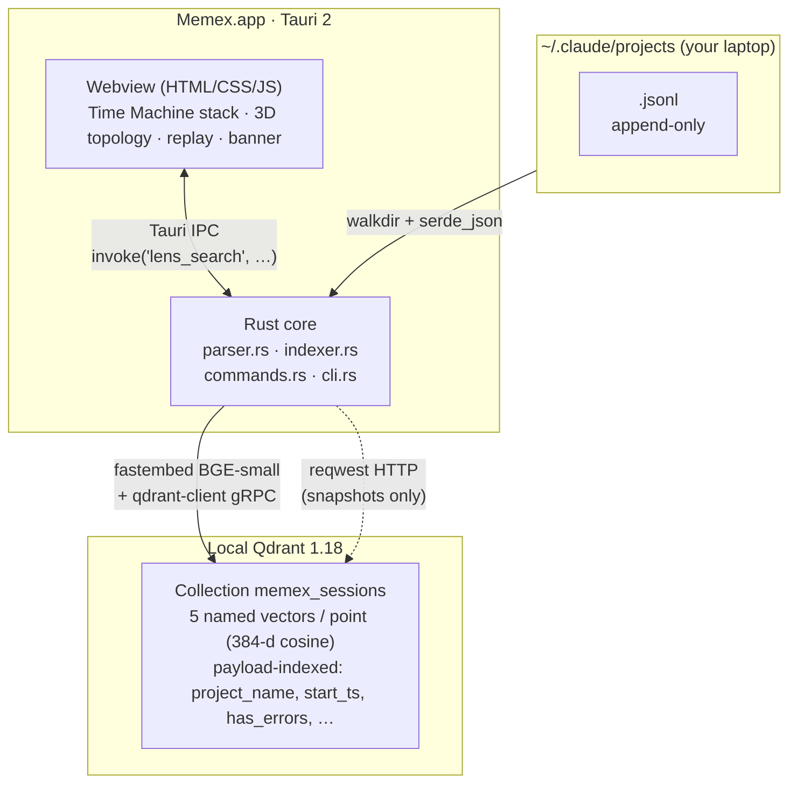

<div align="center">

# Memex

### Your AI session history as a navigable spatial memory.

*Vannevar Bush imagined the original [Memex](https://en.wikipedia.org/wiki/Memex) in 1945 — a personal knowledge machine built on **associative trails**, not search boxes. Eighty years later this is its desktop reincarnation: five Qdrant primitives wired into one **non-chatbot** UI for moving through, replaying, and learning from every Claude Code session you've ever run.*

<p>
  <a href="LICENSE"></a>
  <a href="https://tauri.app"></a>
  <a href="https://qdrant.tech"></a>
  <a href="https://www.rust-lang.org"></a>
  <a href="#install--run"></a>
  <br>
  
  
  
  
</p>

<p>
<a href="#-five-qdrant-primitives"><b>Five Qdrant primitives</b></a> ·
<a href="#-what-you-can-do-with-memex"><b>Use cases</b></a> ·
<a href="#-quick-start"><b>Quick start</b></a> ·
<a href="#-cli-reference"><b>CLI</b></a> ·
<a href="#-architecture"><b>Architecture</b></a> ·
<a href="#-status--roadmap"><b>Status</b></a>
</p>

</div>

---

## 🛑 Why Memex isn't a chatbot

Qdrant Vector Space Day 2026's prompt is unusually direct:

> **"Think Outside the Bot."** *"Forget the classical RAG chatbot."*
> Reimagine vector search beyond conversational interfaces — multi-modal apps, intelligent recommendations, advanced vector search.

Memex takes that literally. There is **no chat window**, **no LLM call at runtime**, **no "ask a question" affordance**. Instead it treats your `~/.claude/projects/**/*.jsonl` corpus the way Bush imagined his Memex would treat a researcher's library: as a **spatial memory** you can step into, point at, and traverse by *similarity* rather than by keyword.

Concretely:

| The "obvious" RAG chatbot version of this | What Memex does instead |
|---|---|
| A text box asking "what session am I looking for?" | A **3D card stack** (Time Machine) showing every past session, navigated by ↑↓ / wheel. |
| Embed-and-retrieve a session's text, summarize it with an LLM. | **Replay** the session turn-by-turn in the *original* webview surface — Bash terminals, Edit diffs, Read snippets, exactly as you saw them live. |
| Answer "have I seen this error before?" via RAG → LLM → text. | **Banner slides in** with the past session whose `error` named-vector neighborhood matches — zero LLM calls. |
| "What other sessions are like this one?" → LLM compares summaries. | **Mix & Match** drops session points into Qdrant's Discovery API and returns ranked neighbors. |
| "What's the structure of my work?" → LLM writes a paragraph. | **3D force-directed topology** of `search_matrix_pairs` data, with auto-labeled clusters, cross-project bridge edges, and gap insights ("‘project-redesign’ ↔ ‘project-yc’ have semantically similar sessions but no bridge — possible unmade connection."). |

Five different Qdrant primitives, five different visual surfaces, zero generative AI in the loop.

---

## 🧠 The corpus

Every Claude Code session you've ever run is sitting on your laptop right now:

```
~/.claude/projects/<encoded-cwd>/<session-uuid>.jsonl
```

Inside each `.jsonl` is your *entire* conversation — every prompt, every tool call, every diff, every output, every error. **Months of personal engineering memory, perfectly preserved, but practically unreachable** without a tool like this.

| Without Memex | With Memex |
|---|---|
| 📁 You have N "social-seeding-v2/v3/v4" projects — were they actually different work, or did you redo it? | Topology cluster auto-labels: *"project-marketing (10 sess) — code + shell · Bash×1350 Edit×1032"*. Three v#'s collapse into one bubble. |
| 🔁 You hit the same `WAL Kind(WouldBlock)` you already debugged last month. | A banner slides in: *"I've seen this — open the session that solved it."* (No LLM, no chat — just a named-vector neighbor.) |
| ⏯ You want to *re-watch* yourself fix a tricky bug. | Open the session in Replay. Step through 600 turns at 4×, see every Bash output and Edit diff exactly as it happened. |
| 🌌 "What did I work on last month?" | A 3D galaxy of every session, color-coded by project, with yellow cross-project bridges where ideas jumped — and gap cards flagging missed connections. |
| 🌐 You stitch results from cloud-hosted, telemetry-bearing services. | Parsing, embedding, similarity search, replay — **all on your machine**. Zero network calls after `cargo build`. |

> Memex turns your `.jsonl` pile into a **spatial, replayable memory machine** powered entirely by local Qdrant + FastEmbed.

---

## 🪟 Demo

> **Place placeholders here for the demo video + key screenshots.** Update once recorded.

| Time Machine stack | Topology galaxy | Replay engine |
|:---:|:---:|:---:|
| _Layered 3D card deck of every past session._ | _Force-directed graph with project clusters + bridge edges + gap insights._ | _Turn-by-turn playback with Bash terminals & Edit diffs._ |
|  |  |  |

▶ **3-min walkthrough video**: _to be added (YouTube unlisted)_

---

## ✨ Five Qdrant primitives

Each surface in Memex maps to a different Qdrant primitive — together they cover *named vectors → matrix sampling → discovery → payload filtering → snapshots*. None of these are the "embed text, retrieve top-K, feed to LLM" loop of classical RAG.

Ordered as you encounter them in the app (visual first, search last):

| # | Surface | Qdrant primitive | What you actually do |
|---|---|---|---|
| 1 | 🪟 **Time Machine layered stack** | `scroll` over the indexed collection (payload-only, no vectors) | When the app boots, every past session appears as a 3D layered card deck. ↑↓ / mouse-wheel time-travels through them. **No search box involved.** |
| 2 | 🌌 **Topology galaxy** | **Distance Matrix API** (`search_matrix_pairs`) → 3D force-directed graph + auto-clustered project labels + gap insights | A WebGL scene of your session corpus. Cluster auto-labels (*"code + shell · Bash×1350 Edit×1032"*), yellow cross-project bridge edges, and **Gap cards** flagging pairs of projects that *should* connect but don't (*"‘project-redesign’ ↔ ‘project-yc’ — semantically similar (sim 0.97) but never bridged."*). |
| 3 | 🧪 **Mix & Match** | **Discovery API** (`DiscoverInput` + context pairs) | Drop sessions as **positives** and **negatives** — Qdrant returns sessions semantically near the positives, far from the negatives. Recommendation, not retrieval. |
| 4 | 🔔 **Proactive recall** | `query()` on the dedicated `error` named vector with `has_errors=true` payload filter, polled every 12 s over `~/.claude/projects` | Working in another Claude Code session and hit a fresh `tool_result.is_error`? A banner slides in: *"I've seen this error before — open the session that solved it."* No LLM, no chat, just a vector neighbor with the right filter. |
| 5 | ⏯ **Replay engine** | Lightweight payload (`source_path`) → on-demand JSONL re-parse | Turn-by-turn animation of any past session with **Bash terminals**, **Edit `-`/`+` diffs**, **Read snippets**, **Task/Agent spawns**. Click to scrub, ⏮ ⏯ ⏭ controls, 1× / 2× / 4× / 8×. (No vector primitive here — but it's the surface Memex's vector primitives *point to*.) |
| 6 | 🔍 **Lens slider** | Multiple **named vectors per point** + parallel `query()` + weighted Rust combine | The "advanced vector search" axis, intentionally last. Five named vectors per session (`content`, `tool`, `path`, `error`, `code`); slide each weight to bias the rank — per-vector contribution chips on each result card so you can *see* which lens earned the hit. |

Plus: **Snapshot** export/import via Qdrant's HTTP snapshot API — your entire indexed memory in one portable file.

ColBERT v2 inline citations are on the roadmap; [`fastembed-rs`](https://github.com/Anush008/fastembed-rs) 5.x doesn't yet ship the model.

---

## 💡 What you can *do* with Memex

Not "what you can ask" — there's no question-answering interface. These are spatial, temporal, and recommendation moves you make on your own corpus:

<table>
<tr><td><b>Browse your work, no query needed</b></td><td>

Launch the app. The Time Machine stack populates with every past session sorted most-recent first. **No search box involved.**

```
↑ / ↓     time-travel through 80 past sessions
⏎         open the focused session in the inspector
mouse-wheel  smooth scrolling through history
```

</td></tr>
<tr><td><b>See the shape of your work</b></td><td>

Open the Topology galaxy. Same-project sessions form clusters; yellow lines are cross-project "bridges" (= shared ideas).

```
→ "project-marketing (10 sess) — code + shell · Bash×1350 Edit×1032"
→ Gap card: "project-redesign ↔ project-yc — semantically similar
            (sim 0.97) but never bridged"
```

The Gap insights are an *intelligent recommendation*, not a search result: they tell you about connections you've *never* made between your own projects.

</td></tr>
<tr><td><b>Recommend, don't retrieve</b></td><td>

Mix & Match drops session points into Qdrant's Discovery API. Two clicks → ranked recommendations.

```
+ pos:  workspace-a session
− neg:  project-meeting session
→ Discover: workspace-b, workspace-c, project-redesign …
   "Sessions like the panel-flavored work, unlike chatty meetings."
```

</td></tr>
<tr><td><b>Get reminded automatically</b></td><td>

A background poller watches `~/.claude/projects` for `tool_result.is_error`. When a fresh one appears, a banner slides in within 12 s:

```
⚡ I've seen this error before:
   project-redesign — 2026-05-15 (sim 0.93)
   [Open replay]   [Dismiss]
```

(No LLM call. No chat surface. Just a Qdrant `query()` against the `error` named vector with `has_errors=true` filter.)

</td></tr>
<tr><td><b>Re-experience a past session</b></td><td>

Click Replay on any card. The Replay engine animates the session turn-by-turn at 1× / 2× / 4× / 8× — Bash terminals, Edit `-`/`+` diffs, Read snippets, Task/Agent spawns, every tool exactly as the user saw it live.

```
600 turns at 4×  ≈ 5 min replay
```

</td></tr>
<tr><td><b>Search, if you still want to</b></td><td>

⌘K opens the Lens. Slide each named vector weight to bias the rank toward `content`, `tool`, `path`, `error`, or `code` — per-vector contribution chips on each card so you can see which lens earned the hit.

```
memex lens "Tauri build failed missing icons" --error 2 --tool 1
```

The Lens slider is intentionally the *last* surface, not the first.

</td></tr>
</table>

</td></tr>
</table>

---

## 🚀 Quick start

```bash
# 1. Clone + install JS deps
gh repo clone sgwannabe/memex ~/memex && cd ~/memex && npm install

# 2. Start Qdrant (binary path — or docker run -d -p 6333:6333 -p 6334:6334 qdrant/qdrant:v1.18.0)
mkdir -p .qdrant && curl -sL https://github.com/qdrant/qdrant/releases/download/v1.18.0/qdrant-aarch64-apple-darwin.tar.gz | tar xz -C .qdrant
./.qdrant/qdrant &

# 3. Index your ~/.claude/projects (downloads BGE-small ~130 MB on first run)
cargo build --release --manifest-path src-tauri/Cargo.toml
./src-tauri/target/release/memex scan --index

# 4. Launch the app
npm run tauri build   # produces src-tauri/target/release/bundle/macos/Memex.app
open src-tauri/target/release/bundle/macos/Memex.app
```

That's it. Hit **⌘K**, type something you worked on last month, watch the cards rank.

<details>
<summary><b>📋 Full prerequisites + step-by-step (click to expand)</b></summary>

### Prerequisites

- **macOS 11+** (Apple Silicon recommended; tested on macOS 26.5 / arm64)
- [**Rust**](https://rustup.rs) 1.88+
- [**Node.js**](https://nodejs.org) 22+ with npm
- [**Qdrant**](https://github.com/qdrant/qdrant/releases) 1.18+ (binary or Docker)

### Step 1 — Clone

```bash
gh repo clone sgwannabe/memex ~/memex
cd ~/memex
npm install
```

### Step 2 — Start Qdrant

Either download the prebuilt binary…

```bash
mkdir -p .qdrant && cd .qdrant
curl -sL https://github.com/qdrant/qdrant/releases/download/v1.18.0/qdrant-aarch64-apple-darwin.tar.gz | tar xz
./qdrant            # serves Qdrant on localhost:6333 (HTTP) + 6334 (gRPC)
```

…or run it via Docker:

```bash
docker run -d -p 6333:6333 -p 6334:6334 qdrant/qdrant:v1.18.0
```

Verify: `curl localhost:6333 | jq .title` should print `"qdrant - vector search engine"`.

### Step 3 — Authorize Full Disk Access

On **macOS Sequoia / Tahoe**, granting `Memex.app` **Full Disk Access** in System Settings → Privacy & Security is required so it can read `~/.claude/projects`. Memex never sends your sessions anywhere — every embedding and similarity call happens locally in Rust + Qdrant.

### Step 4 — First index

The CLI is the same binary as the GUI; it dispatches on `argv[1]`. The first run downloads the BGE-small-en-v1.5 ONNX model (~130 MB) into `.fastembed_cache/`.

```bash
cargo build --release --manifest-path src-tauri/Cargo.toml
./src-tauri/target/release/memex scan --index
```

You should see:
```
parsed 80 session(s) (shown: 80), 17752 total tool calls
indexed 79/80 session(s) into 'memex_sessions' (1 duplicate sessionId(s) skipped, 0 error(s))
```

### Step 5 — Launch

```bash
npm run tauri dev      # hot-reload dev mode
# OR
npm run tauri build    # → src-tauri/target/release/bundle/macos/Memex.app + .dmg
```

When the window opens, the bottom status bar should read:
```
Connected — 79 sessions indexed (memex_sessions)
```

</details>

---

## 🛠 CLI reference

Memex's CLI is a one-binary surface over the same backend the GUI uses:

```bash
memex scan [--index] [--path PATH] [--limit N]    # walk + (optionally) index
memex search "query"                              # plain content-vector search
memex lens "query" --content 2 --tool 1.5 --code 0.5
memex mix --pos <session_id> --neg <session_id>
memex topology --sample 80 --per-point 6 --out topo.json
memex recall "Tauri build failed missing icons"
memex snapshot export ./memex.snapshot
memex snapshot import ./memex.snapshot
```

Run `memex --help` for the full surface; each subcommand has `--help` too.

---

## 🏗 Architecture



Each session becomes **one point** with **five named vectors** (`content`, `tool`, `path`, `error`, `code`) all dense 384-d BGE-small. The payload carries only metadata — replay re-parses the JSONL on demand so Qdrant stays lean.

Deeper reading:
- [`docs/architecture.md`](docs/architecture.md) — data flow, schema, design trade-offs
- [`docs/qdrant-features.md`](docs/qdrant-features.md) — engineer's tour of each of the 5 features
- [`docs/memex/PLAN.md`](docs/memex/PLAN.md) — original 8-phase implementation plan

---

## 🔬 Tech stack

<table>
<tr>
<td><b>Frontend</b></td>
<td>

`vanilla HTML/CSS/JS` · `Tauri 2 webview` · [`3d-force-graph`](https://github.com/vasturiano/3d-force-graph) (Three.js) for topology · CSS 3D `translateZ` for the Time Machine layered stack

</td>
</tr>
<tr>
<td><b>Backend</b></td>
<td>

`Rust 1.88` · [`tauri 2`](https://tauri.app) · [`qdrant-client 1.18`](https://github.com/qdrant/rust-client) · [`fastembed 5`](https://github.com/Anush008/fastembed-rs) (BGE-small-en-v1.5) · [`petgraph 0.6`](https://github.com/petgraph/petgraph) for MST · [`tokio`](https://tokio.rs) · `walkdir` · `serde` · `regex`

</td>
</tr>
<tr>
<td><b>Storage</b></td>
<td>

[`Qdrant 1.18`](https://qdrant.tech) (local binary or Docker) — 5 named dense vectors per point (384-d cosine), payload-indexed on `project_name`, `git_branch`, `start_ts`, `has_errors`, etc.

</td>
</tr>
<tr>
<td><b>Embedding</b></td>
<td>

`fastembed-rs` running BGE-small-en-v1.5 entirely client-side. No Python sidecar, no network calls, ~130 MB ONNX model cached after first run.

</td>
</tr>
<tr>
<td><b>Bundle</b></td>
<td>

`Memex.app` ~45 MB · `Memex_0.1.0_aarch64.dmg` ~15 MB · No code signing in MVP — right-click → Open the first time.

</td>
</tr>
</table>

---

## 📊 Status & roadmap

This is a **hackathon MVP** built for [Qdrant Vector Space Day 2026](https://qdrant.tech) (deadline 2026-06-01). Verified end-to-end on the author's `~/.claude/projects` (**79 sessions indexed, 17,938 tool calls covered**), with all five primitives exercisable from both CLI and GUI.

**Hackathon alignment** — *"Think Outside the Bot"*:

- ✅ No chat surface · no LLM in the runtime loop · no "ask a question" affordance
- ✅ **5 distinct Qdrant primitives** (named vectors / Distance Matrix / Discovery / payload filter / Snapshot), each wrapped in a visual UI rather than a text retrieval pipeline
- ✅ Two of the surfaces (Proactive Recall, Mix & Match) are *recommendation* features — explicitly called out as an encouraged direction in the VSD prompt
- ✅ Single-machine, zero-telemetry, zero-network architecture

**What ships in this MVP**

- ✅ 🪟 Time Machine layered 3D card stack on boot (browse, no query needed)
- ✅ 🌌 3D force-directed topology galaxy with project cluster auto-labels + gap insights
- ✅ 🧪 Mix & Match recommendation via Qdrant Discovery API
- ✅ 🔔 Proactive recall banner (12 s poll over `~/.claude/projects`)
- ✅ ⏯ Replay engine with Bash / Edit-diff / Read / Task tool visualizations at 1×–8×
- ✅ 🔍 Lens slider (multi-named-vector weighted search) — the "advanced vector search" axis
- ✅ Snapshot export/import via Qdrant HTTP API
- ✅ Lazy AppState init — self-heals if Qdrant is started after Memex
- ✅ Honest duplicate-sessionId detection in indexer reporting
- ✅ `Memex.app` + `.dmg` for macOS arm64

**Deferred to post-MVP**

| Item | Why it's deferred | Path forward |
|---|---|---|
| ColBERT v2 inline citations | `fastembed-rs` doesn't yet expose the model | Fallback via `ort` crate + ONNX Jina-ColBERT-v2 |
| BM42 sparse on `path` vector | Same upstream gap | Same path |
| Real `notify` file watcher | Polling works and avoids fd-leak / macOS permission edge cases | Code path already in `Cargo.toml` — one-line swap when needed |
| Native file picker for snapshots | MVP uses `window.prompt()` | Add `tauri-plugin-dialog` |
| Code signing / notarization | Local-only MVP | Apple Developer cert when shipping publicly |

---

## 🤝 Contributing / feedback

This is a personal hackathon project, but PRs that don't break the demo are welcome — especially:
- Linux + Windows packaging
- Codex / Cursor / other CLI session formats (parser extension)
- ColBERT v2 integration via `ort`

For bugs or design feedback, [open an issue](https://github.com/sgwannabe/memex/issues/new).

---

## 📄 License

[Apache 2.0](LICENSE) © 2026 Sangguen Chang.

Built on the excellent open work of [Qdrant](https://github.com/qdrant/qdrant), [Tauri](https://github.com/tauri-apps/tauri), [fastembed-rs](https://github.com/Anush008/fastembed-rs), [petgraph](https://github.com/petgraph/petgraph), and [3d-force-graph](https://github.com/vasturiano/3d-force-graph).

<div align="center">
<sub>Made for <a href="https://qdrant.tech">Qdrant Vector Space Day 2026</a> · <a href="https://github.com/sgwannabe/memex">sgwannabe/memex</a></sub>
</div>
