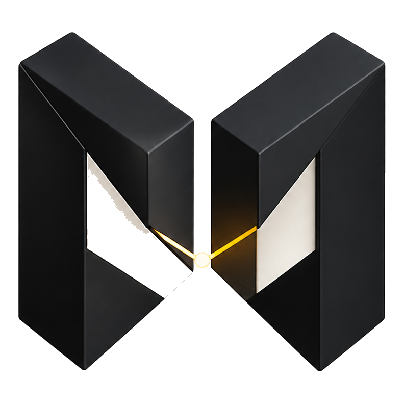
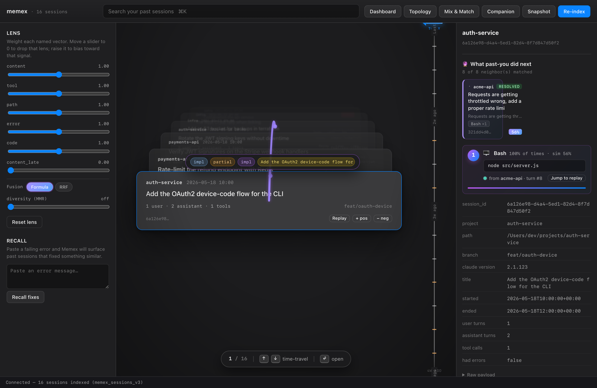
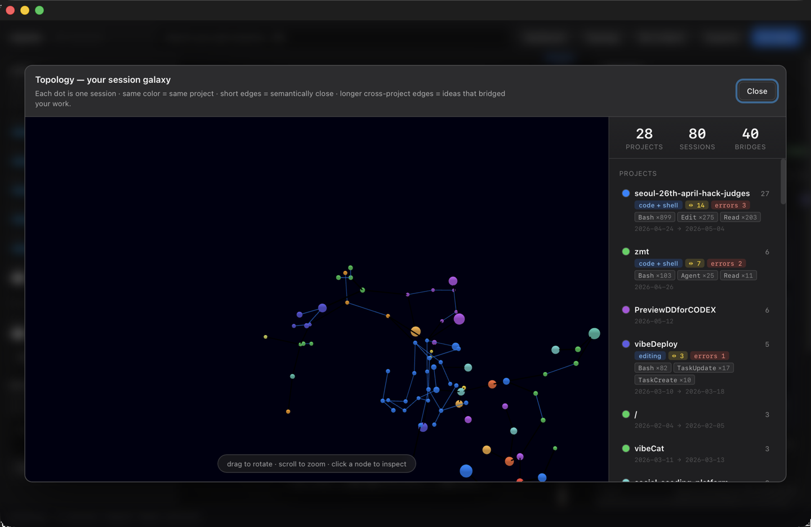
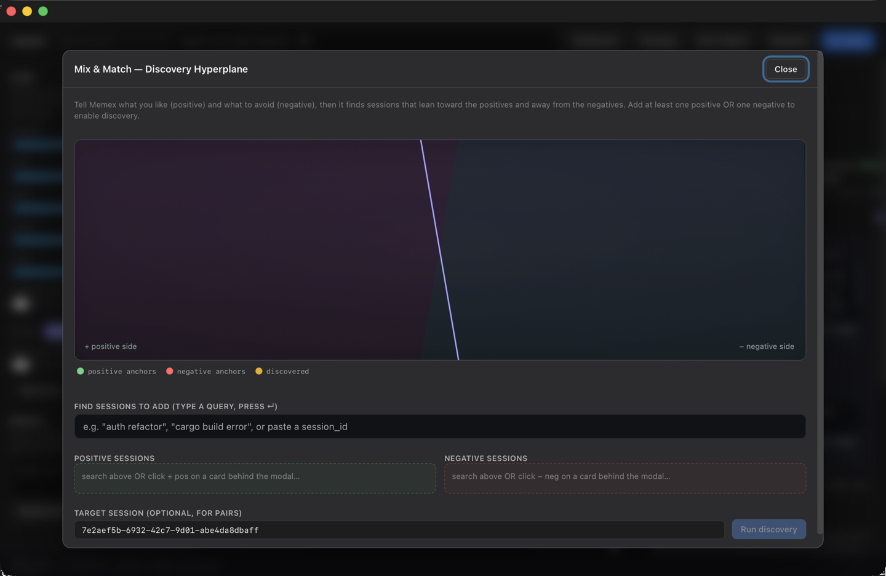
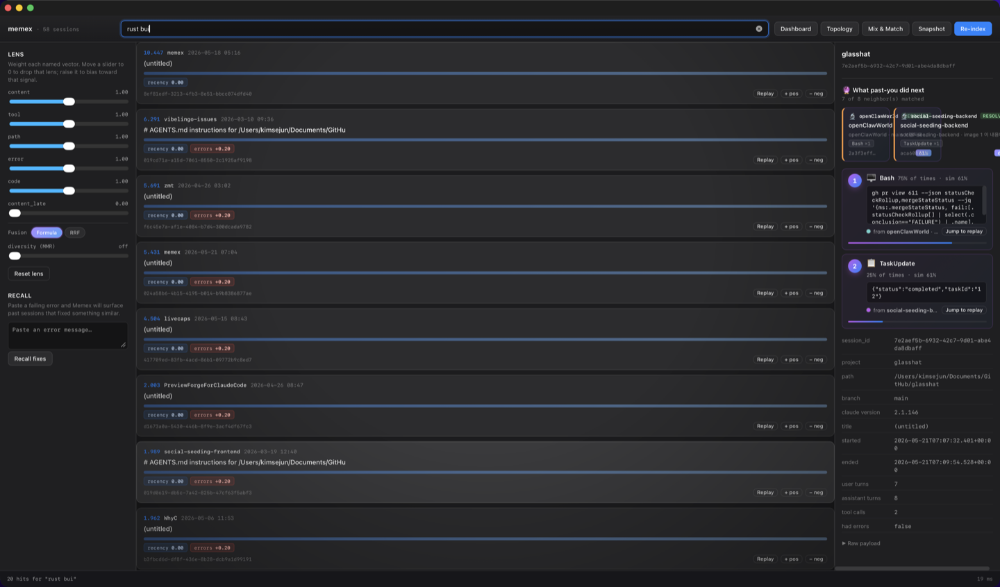
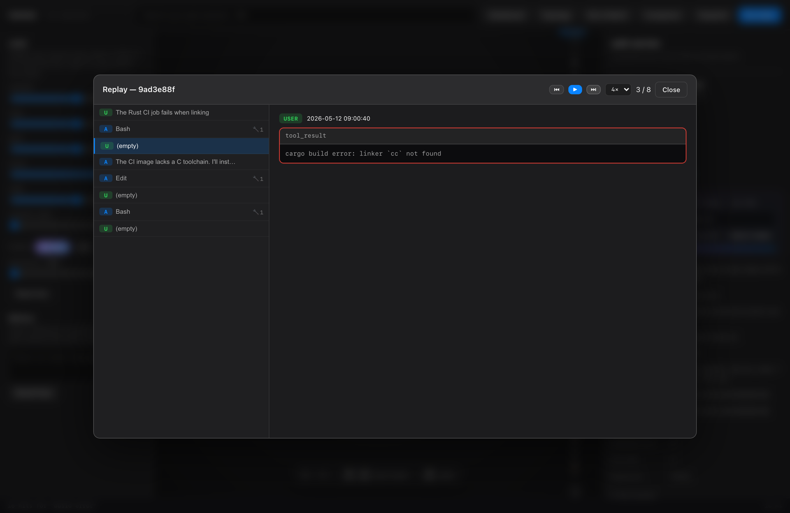
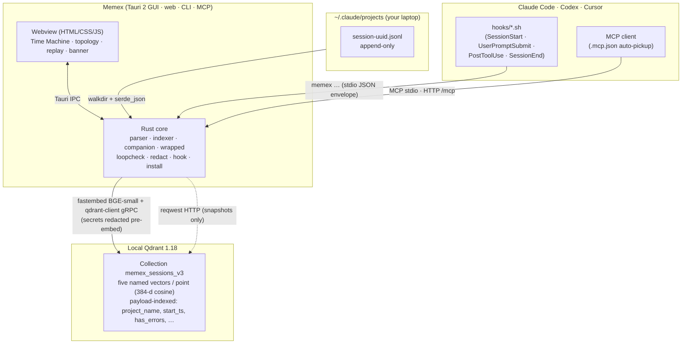

<div align="center">



# Memex

**Local memory for coding agents.**

Your Claude Code and Codex sessions, searchable by similarity, replayable
turn-by-turn, and mined for what past-you already figured out — powered by local
Qdrant, with no chatbot and no LLM at runtime.

<sub>100% local · no telemetry · no LLM at runtime</sub>

<p>
  <a href="https://github.com/Two-Weeks-Team/memex/actions/workflows/ci.yml"></a>
  <a href="LICENSE"></a>
  <a href="https://qdrant.tech"></a>
  <a href="https://www.rust-lang.org"></a>
  <a href="https://tauri.app"></a>
  
</p>

<a href="https://memex.quest"><b>Landing</b></a> ·
<a href="#quick-start"><b>Quick start</b></a> ·
<a href="#not-a-chatbot"><b>Surfaces</b></a> ·
<a href="#mcp-server--agent-integration"><b>MCP</b></a> ·
<a href="#architecture"><b>Architecture</b></a> ·
<a href="#status--roadmap"><b>Status</b></a>

</div>

---

Built for [Qdrant Vector Space Day 2026](https://qdrant.tech) — *"Think Outside the Bot."*
All code was authored during the hackathon build period (May 2026).

## Why Memex

Every Claude Code and Codex session you run is written to your laptop as JSONL —
every prompt, tool call, diff, and error. That is months of engineering memory,
perfectly preserved but practically unreachable: there is no good way to ask
*"have I solved this before?"* across hundreds of past sessions.

Memex indexes that history into a local [Qdrant](https://qdrant.tech) collection
and turns it into something you can move through, replay, and learn from. It is a
memory you own: everything runs on your machine, and a one-click Qdrant snapshot
makes your indexed corpus portable and permanent — independent of how any vendor
rotates or prunes its own session storage over time.

The name is a nod to Vannevar Bush's 1945 [memex](https://en.wikipedia.org/wiki/Memex)
— a machine for moving through everything you've recorded by following associative
trails rather than a search box. Eighty years on, this brings that idea to the trail
you leave across your coding sessions.

## Not a chatbot

Vector Space Day 2026 asked builders to *"Think Outside the Bot."* Memex takes
that literally: there is no chat window, no "ask a question" box, and no LLM call
at runtime. Instead, a handful of Qdrant primitives *are* the product — your
session corpus becomes a space you traverse by similarity, not a thing you query.

Seven surfaces, each mapped to a Qdrant capability rather than an
embed-retrieve-prompt RAG loop. Ordered as you meet them in the app (visual
first, search last):

| Surface | Qdrant primitive | What you do |
| --- | --- | --- |
| Time Machine | payload `scroll` (no vectors) | A 3D card deck of every past session on boot. Arrow keys / wheel to time-travel. No search box. |
| Topology | Distance Matrix → MST | A force-directed galaxy of your corpus: auto-labeled project clusters, cross-project bridges, and gap cards for projects that *should* connect but never did. |
| Mix & Match | Discovery API | Drop sessions as positives and negatives; Qdrant returns neighbors near one and far from the other. Recommendation, not retrieval. |
| Proactive recall | `error` named vector + payload filter | Hit a fresh error in another session and a banner slides in: *"seen this error before — open the session that solved it."* |
| Predict next-action | `content` neighbors + tool aggregation | Embed a session's recent turns, find similar past sessions, walk forward, and rank what past-you did next. |
| Replay | payload `source_path` → on-demand JSONL re-parse | Turn-by-turn playback of any session — Bash output, Edit diffs, Read snippets — at 1×–8×. |
| Lens | five named vectors + weighted combine | Weighted multi-vector search with per-vector contribution chips. Intentionally the last surface, not the first. |

Plus **Snapshot** export/import over Qdrant's HTTP snapshot API — your entire
indexed memory in one portable file.

## Demo

Real screenshots from the running app (macOS, Apple Silicon) over an indexed
corpus of **80 sessions across 28 projects**.

| Time Machine | Topology | Mix & Match |
|:---:|:---:|:---:|
|  |  |  |
| **Lens search** | **Predict next-action** | **Replay** |
|  |  |  |

## Download

On macOS (Apple Silicon), install with Homebrew — the cask pulls the signed,
notarized app:

```sh
brew install --cask two-weeks-team/tap/memex   # upgrade later: brew upgrade --cask memex
```

Or grab the DMG directly:
**[Memex v0.1.2 for macOS (Apple Silicon)](https://github.com/Two-Weeks-Team/memex/releases/latest)**
— `Memex_0.1.2_aarch64.dmg` (~19 MB), signed with a Developer ID and notarized,
so it opens without a Gatekeeper warning. Drag **Memex.app** to `/Applications`.
Clean-machine notes and a source build: [docs/INSTALL.md](docs/INSTALL.md).

Memex needs a local Qdrant on `localhost:6334` (it self-heals if you start Qdrant
after launch). Prefer to compile it yourself? See [Quick start](#quick-start).

## MCP server & agent integration

Memex ships a [Model Context Protocol](https://modelcontextprotocol.io) server
(stdio JSON-RPC and HTTP, hand-rolled, no external runtime). Any MCP client —
Claude Code, Codex, Cursor — can call into your local session corpus
mid-conversation, with no new network calls. The server exposes **12 tools**
(11 read, 1 write) over the same Qdrant index the desktop app uses:

| Tool | What it does |
| --- | --- |
| `find_similar_sessions` | Five-vector weighted Lens search, with per-vector contribution scores. |
| `find_similar_error` | Neighbor search on the `error` vector, filtered to sessions that hit errors. |
| `predict_next_action` | Neighbor walk + tool-call aggregation — "what would past-you do next?" |
| `mix_similar_sessions` | Discovery API: near the positives, away from the negatives. |
| `get_session_summary` | Metadata payload: project, branch, title, timestamps, turn counts. |
| `get_session_turn` | A single turn, re-parsed from source JSONL. |
| `list_recent_sessions` | Most-recent-first walk, works before Qdrant is warm. |
| `analyze_corpus_topology` | MST, per-project labels, cross-project bridges, gap insights. |
| `snapshot_export` | Server-side snapshot of the collection to a portable file. |
| `get_project_memory` | Cold Start Killer — a ready-to-paste memory primer for a repo. |
| `generate_wrapped_report` | Engineering Wrapped — a corpus-wide digest for the last *N* days. |
| `refresh_session_enrich` | *(write)* Re-runs the enrich pipeline and overwrites the payload. |

### Companion family

Three surfaces turn Memex from a passive archive into an active memory layer your
agent uses through MCP. All are deterministic, zero-LLM, and emit plain markdown
you can paste into a system prompt:

| Surface | Trigger | What it returns |
| --- | --- | --- |
| Cold Start Killer | a new session opens in a known repo | a memory primer — decisions you already made, known pitfalls, stack fingerprint |
| Engineering Wrapped | `memex wrapped` | a digest — top tools, intent / outcome mix, decisions you keep re-making |
| Loop Breaker | ≥ 3 tool errors in the last 10 turns | the past session where you broke a similar loop, deep-linked to the fix |

### Hooks (optional, opt-in)

`memex install` wires four Claude Code hooks (SessionStart, UserPromptSubmit,
PostToolUse, SessionEnd) that inject memory at the right moments. Hooks are
**not committed** — a repo that shells out on clone is a security risk — so they
install into your gitignored `.claude/settings.local.json` only when you opt in,
and `memex install uninstall` removes them. Every hook is fail-open and bounded
by `timeout`, so a slow engine never blocks a session. Index-time secret
redaction and a loopback-only Qdrant URL allowlist are on by default. Details:
[docs/agent-integration.md](docs/agent-integration.md).

## Quick start

You need [Rust](https://rustup.rs) 1.88+, [Node](https://nodejs.org) 22+,
[Qdrant](https://github.com/qdrant/qdrant) 1.18 (Docker or binary), and macOS
(Apple Silicon) for the GUI. Non-mac? The headless
[Docker `web` variant](deploy/web/README.md) runs Qdrant + the web UI/API + MCP
in one container on any platform.

```bash
# 1. Clone + JS deps
gh repo clone Two-Weeks-Team/memex ~/memex && cd ~/memex && npm install

# 2. Start Qdrant (Docker; data persists in a named volume)
bash scripts/start-qdrant.sh

# 3. Build the binary and put it on PATH for this shell
cargo build --release --manifest-path src-tauri/Cargo.toml
export PATH="$PWD/src-tauri/target/release:$PATH"
```

**Track A — 60-second judge demo (synthetic corpus, no private data):**

```bash
memex scan --path examples/sample-corpus --index
#   parsed 12 session(s), indexed 12/12 into 'memex_sessions_v3'
memex lens     "build error" --error 2.0 --content 1.0
memex mix      --pos <id> --neg <id>
memex topology --sample 12 --out /tmp/topo.json
memex recall   "cargo build linker error"
```

End-to-end proof: [docs/e2e-evidence.md](docs/e2e-evidence.md) ·
expected hits per query: [examples/sample-corpus/README.md](examples/sample-corpus/README.md)

**Track B — index your own sessions:**

```bash
memex scan --index            # walks ~/.claude/projects (downloads BGE-small ~130 MB on first run)
npm run tauri build           # builds Memex.app
open src-tauri/target/release/bundle/macos/Memex.app
```

**Any platform — headless Docker** (Qdrant + web UI/API + MCP in one image, no macOS needed):

```bash
docker build -t memex-allinone -f deploy/web/Dockerfile .
docker run --rm -p 8765:8765 memex-allinone          # the sample corpus auto-indexes on boot
claude mcp add --transport http memex-web http://localhost:8765/mcp
```

More on the server variant: [deploy/web/README.md](deploy/web/README.md).

**Give your coding agent the context.** Once Memex is running (any of the above):

```bash
memex install all                       # register the MCP server + hooks for Claude Code / Codex / Cursor
memex memory --cwd "$(pwd)" | pbcopy    # or hand it the primer yourself: decisions, pitfalls, stack
```

The agent can then call memex's [12 MCP tools](#mcp-server--agent-integration)
mid-session — recall a similar error, predict the next action, or load a project
memory primer at turn zero so it starts with what past-you already decided.

<details>
<summary>Full step-by-step (Qdrant ports, Full Disk Access, build variants)</summary>

- **Qdrant** listens on `6334` (gRPC, used by Memex via `MEMEX_QDRANT_URL`) and
  `6333` (REST + dashboard). Health: `curl -fsS http://localhost:6333/readyz`.
  Stop with `bash scripts/start-qdrant.sh --stop` (data is preserved).
- **Full Disk Access** — grant it to `Memex.app` in System Settings → Privacy &
  Security so it can read `~/.claude/projects` and `~/.codex/sessions`. Nothing
  leaves your machine.
- **First index** prints, e.g., `parsed 80 session(s), 17,752 total tool calls`
  then `indexed 79/80 session(s) into 'memex_sessions_v3'`. The status bar reads
  `Connected — 79 sessions indexed`.
- **Build variants**: `npm run tauri dev` (hot reload), `npm run tauri build`
  (local release), `npm run tauri:dist` (distribution `.dmg`, devtools off).

Clean-machine and source-build details: [docs/INSTALL.md](docs/INSTALL.md) ·
[docs/BUILD.md](docs/BUILD.md).

</details>

## CLI

The CLI is the same binary as the GUI; it dispatches on the first argument.

```bash
memex scan [--index] [--path PATH]                # walk + optionally index
memex search "query"                              # plain content-vector search
memex lens   "query" --content 2 --tool 1.5 --code 0.5
memex mix    --pos <session_id> --neg <session_id>
memex topology --sample 80 --per-point 6 --out topo.json
memex recall  "Tauri build failed missing icons"
memex predict <session_id> --last-n 3 --horizon 3 --neighbors 8
memex memory  --cwd "$(pwd)" --limit 8            # Cold Start Killer primer
memex wrapped --window-days 30                    # Engineering Wrapped digest
memex snapshot export ./memex.snapshot
memex snapshot import ./memex.snapshot

memex install all [--hooks] [--dry-run]           # wire MCP + hooks into Claude / Codex / Cursor
memex install uninstall                           # remove every memex-tagged block
memex serve  --port 8765 --ui-dir src             # headless UI + JSON API + HTTP MCP (web variant)
```

Run `memex --help`, and `--help` on any subcommand, for the full surface.

## Architecture



Each session is one Qdrant point with **five named dense vectors** (`content`,
`tool`, `path`, `error`, `code`), all 384-d BGE-small; the v3 schema also carries
a ColBERT-style multivector rerank lane (on by default) and two sparse slots. The payload holds
only metadata — Replay re-parses the JSONL on demand, so Qdrant stays lean.
Design deep-dives are listed under [Documentation](#documentation).

## Tech stack

| Layer | Choices |
| --- | --- |
| Frontend | vanilla HTML/CSS/JS in a Tauri 2 webview; [3d-force-graph](https://github.com/vasturiano/3d-force-graph) (Three.js) for topology; CSS 3D for the Time Machine stack |
| Backend | Rust 1.88, [Tauri 2](https://tauri.app), [qdrant-client 1.18](https://github.com/qdrant/rust-client), [fastembed 5](https://github.com/Anush008/fastembed-rs), [petgraph](https://github.com/petgraph/petgraph) (MST), tokio, [axum](https://github.com/tokio-rs/axum) (web variant) |
| Storage | [Qdrant 1.18](https://qdrant.tech) — five named dense vectors per point (384-d cosine), payload-indexed |
| Embedding | `fastembed-rs` 5.15 running BGE-small-en-v1.5 client-side; ~130 MB ONNX model cached after first run, no Python, no network |
| Bundle | `Memex_0.1.2_aarch64.dmg` (~19 MB), signed with a Developer ID and notarized; also on Homebrew (`brew install --cask two-weeks-team/tap/memex`) |

## Documentation

| Topic | Read |
| --- | --- |
| Architecture & schema | [architecture.md](docs/architecture.md) (data flow + schema) · [qdrant-features.md](docs/qdrant-features.md) (v3 schema tour) · [wired-but-dormant.md](docs/wired-but-dormant.md) (honest capability status) |
| Agent integration | [agent-integration.md](docs/agent-integration.md) (hooks + MCP) · [deploy/web/README.md](deploy/web/README.md) (headless server variant) |
| Evidence | [e2e-evidence.md](docs/e2e-evidence.md) (runs end-to-end) · [benchmarks.md](docs/benchmarks.md) (quantization sweep + measured numbers) · [examples/sample-corpus/README.md](examples/sample-corpus/README.md) (expected query hits) |
| Install & build | [INSTALL.md](docs/INSTALL.md) (clean-machine install) · [BUILD.md](docs/BUILD.md) (source build) |

## Status & roadmap

A hackathon MVP built for Vector Space Day 2026. Verified end-to-end on the
author's `~/.claude/projects` (**79 sessions indexed, 17,752 tool calls**), with
every surface exercisable from both the CLI and the GUI.

**Think Outside the Bot — alignment**

- No chat surface, no LLM in the runtime loop, no "ask a question" affordance.
- Five distinct Qdrant primitives (named vectors, Distance Matrix, Discovery,
  payload filters, Snapshot), each wrapped in a visual surface.
- Two surfaces (Proactive recall, Mix & Match) are recommendation features — an
  explicitly encouraged direction in the prompt.
- Single-machine, zero-telemetry, zero-network after build.

**What ships in this MVP**

- Seven surfaces: Time Machine, Topology, Mix & Match, Proactive recall, Predict,
  Replay, Lens — plus Snapshot export/import.
- Companion family: Cold Start Killer, Engineering Wrapped, Loop Breaker.
- Agent integration: `memex install` wires four Claude Code hooks, a committed
  `.mcp.json`, Codex `notify`, Cursor MCP, and a shell primer.
- Headless Docker `web` variant (Qdrant + web UI/API + HTTP MCP) with a
  Prometheus `/metrics` endpoint.
- Security: index-time secret redaction and a loopback-only Qdrant allowlist.
- Tested: 290+ Rust unit tests, integration tests for the Loop Breaker pipeline,
  and Playwright E2E specs. All CI checks green.
- Upstream contribution: the team added `with_intra_threads` (a configurable
  ONNX intra-op thread count) to
  [fastembed-rs](https://github.com/Anush008/fastembed-rs/pull/255) — merged and
  shipped in 5.15. Memex uses it via `MEMEX_EMBED_THREADS` so embedding doesn't
  peg every core and the desktop UI stays responsive.

**Where it's going** — Memex starts as personal memory (one developer, one
laptop). The natural next step is shared memory: team and organization corpora on
[Qdrant Cloud](https://qdrant.tech), with the same surfaces over a multi-user
index. Roadmap, not shipped.

**Deferred to post-MVP**

| Item | Why | Path forward |
| --- | --- | --- |
| ColBERT v2 inline citations | `fastembed-rs` doesn't expose the model yet | `ort` crate + ONNX Jina-ColBERT-v2 |
| BM42 sparse on the `path` vector | same upstream gap | same path |
| Linux / Windows GUI packaging | macOS-first MVP | Tauri cross-build; the `web` variant already runs anywhere |

## Contributing

A personal hackathon project, but PRs that don't break the demo are welcome —
especially Linux/Windows packaging, more session formats (Codex/Cursor parser
extensions), and ColBERT v2 via `ort`. For bugs or design feedback,
[open an issue](https://github.com/Two-Weeks-Team/memex/issues/new).

## License

[Apache 2.0](LICENSE) © 2026 Sangguen Chang.

Built on the work of [Qdrant](https://github.com/qdrant/qdrant),
[Tauri](https://github.com/tauri-apps/tauri),
[fastembed-rs](https://github.com/Anush008/fastembed-rs),
[petgraph](https://github.com/petgraph/petgraph), and
[3d-force-graph](https://github.com/vasturiano/3d-force-graph).
