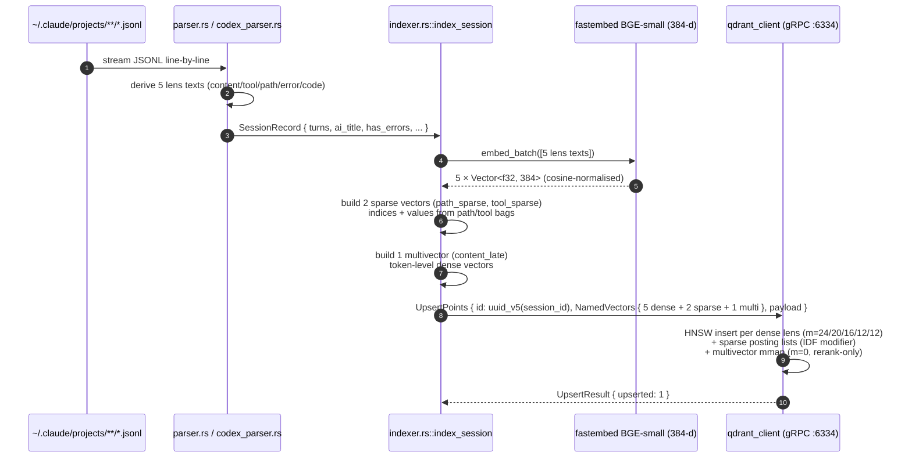
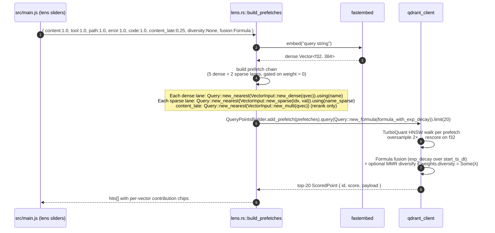
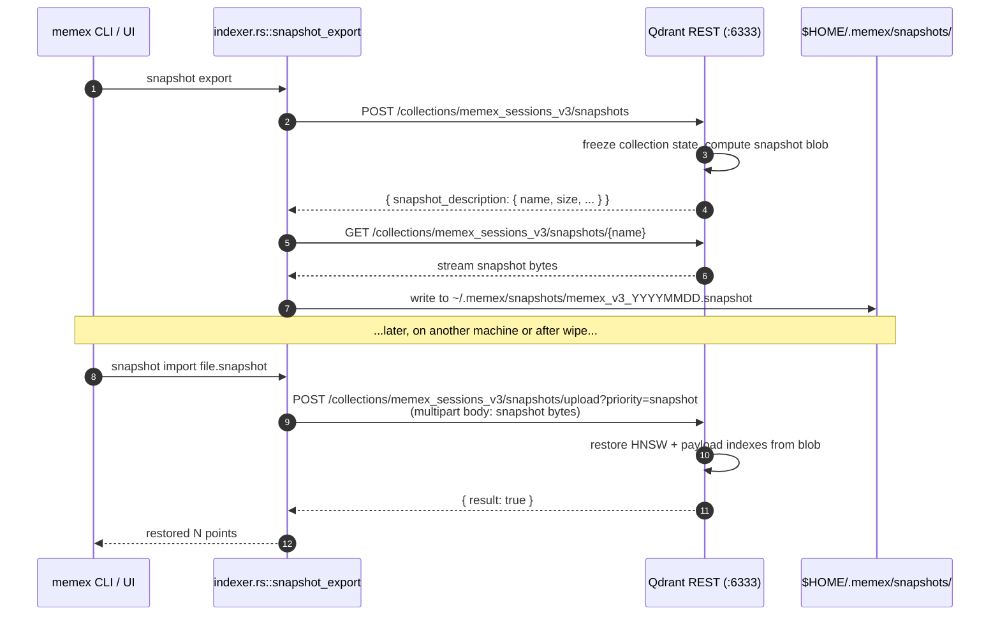

# Memex — Architecture

A one-screen reference for someone reading the code for the first time.

## High-level data flow

```
                              ┌──────────────────────┐
   ┌─ user                    │ ~/.claude/projects/  │
   │   (you)                  │   <enc-cwd>/         │
   │                          │     <uuid>.jsonl     │  ← source of truth, append-only
   │                          └──────────┬───────────┘
   │                                     │ walkdir + serde_json
   │                                     ▼
   │   ┌──────────────────────────────────────────────────┐
   │   │ parser.rs   ── Session / Turn / ToolCall structs │
   │   │  parse_session()  scan_dir()                     │
   │   └────────┬─────────────────────────────────────────┘
   │            │ per-session: 5 string extracts
   │            ▼
   │   ┌──────────────────────────────────────────────────┐
   │   │ indexer.rs                                       │
   │   │  Embedder (fastembed BGE-small-en-v1.5, Mutex)   │
   │   │  ensure_collection() / index_session() / bulk    │
   │   │  lens_search() / mix_match() / topology()        │
   │   │  recall() / snapshot_export() / snapshot_import()│
   │   └────────┬─────────────────────────────────────────┘
   │            │ qdrant-client 1.18 (gRPC) / reqwest (HTTP for snapshots)
   │            ▼
   │   ┌──────────────────────────────────────────────────┐
   │   │ local Qdrant 1.18.1                              │
   │   │ collection `memex_sessions`                      │
   │   │  point_id = uuid_v5(session_id)                  │
   │   │  vectors  = {content, tool, path, error, code}   │
   │   │             each = 384-d cosine BGE-small        │
   │   │  payload  = JSON metadata (project, branch, …)   │
   │   └──────────────────────────────────────────────────┘
   │
   ▼
┌────────────────────────────────────────────────────────┐
│  Tauri 2 webview                                       │
│  index.html / main.js / styles.css                     │
│  ↑ window.__TAURI__.core.invoke(<cmd>, args) ↓         │
│  commands.rs — thin wrappers over indexer + parser     │
└────────────────────────────────────────────────────────┘
```

## Per-session indexing

Each session gets **one** Qdrant point with five named vectors. The point id is
`uuid_v5(NAMESPACE_DNS, session_id)` so re-indexing is idempotent.

| Vector  | Source text                                                                                   |
|---------|-----------------------------------------------------------------------------------------------|
| content | `title:` + every user/assistant text turn, prefixed with `U:` / `A:`                          |
| tool    | One line per tool call: `<ToolName>: <command|file_path|url|query|description>` (160-char cap)|
| path    | All file/notebook paths and URLs referenced anywhere in the session                           |
| error   | Concatenation of every `tool_result.is_error=true` content + heuristic "Error:" lines         |
| code    | Every fenced code block + Edit/Write `new_string` / `content`                                 |

Each extract is capped at 6 000 chars (BGE-small ≈ 512-token limit; we
intentionally over-allocate the cap so partial truncation still gives the
embedder useful context).

The payload carries everything the frontend needs to render a result card or
inspector pane without making a second roundtrip:

```jsonc
{
  "session_id": "df1906d2-…",
  "source_path": "~/.claude/projects/…/df1906d2-….jsonl",
  "project_name": "project-meeting",
  "project_path": "~/projects/project-meeting",
  "git_branch":   "main",
  "ai_title":     "(may be empty if Claude didn't title the session)",
  "claude_version":"2.1.143",
  "start_iso":    "2026-05-17T09:15:18.335Z",
  "end_iso":      "2026-05-17T10:48:02.000Z",
  "start_ts":     1747469718,
  "end_ts":       1747475282,
  "user_turns":   232,
  "assistant_turns":403,
  "tool_count":   220,
  "has_errors":   true
}
```

Payload indexes are created on `project_name`, `project_path`, `git_branch`,
`ai_title` (text), `start_ts` (integer for range scans), and `has_errors`.

## The five features, code-side

| Feature        | Backend (`indexer.rs`)             | Notes                                                                                |
|----------------|------------------------------------|--------------------------------------------------------------------------------------|
| Lens slider    | `lens_search()`                    | Runs one cosine search per non-zero weight, then a weighted combine in Rust. We avoid Qdrant's RRF/formula because RRF ignores weights and formulas are harder to debug. The trade-off: 5 round-trips instead of 1 — but Qdrant handles those in parallel server-side anyway. |
| Mix & Match    | `mix_match()`                      | Builds `ContextInputPair`s from session ids → `DiscoverInput { target, context }`. Qdrant 1.18 server requires `target`; we use the first positive as the anchor. |
| Topology       | `topology()`                       | `search_matrix_pairs` returns scored pairs; we build an undirected `petgraph::UnGraph<String, f32>` and call `min_spanning_tree` for the MST that the SVG renders. |
| Replay         | `get_session_turns()`              | Looks up the payload, reads `source_path`, re-parses the JSONL on demand. Keeps Qdrant payloads small while still letting the UI scrub any session at full resolution. |
| Proactive recall | `tail_recent_errors()` + `recall()` | The frontend polls `tail_recent_errors` every 12 s (cheap: ~50 ms on 80 sessions). On a fresh error, it calls `recall()` which searches the `error` named vector with a `has_errors=true` filter. |

## Sequence diagrams (v3)

Three flows the rest of the document references. All three target the v3
collection (`memex_sessions_v3`) — 5 dense + 2 sparse + 1 multivector slots
per point, server-side Formula fusion, TurboQuant bits-2 quantization.

### (a) Index path — parser → embed → upsert



The `uuid_v5(session_id)` deterministic point id keeps `index --force-rebuild`
idempotent: a re-index of the same session updates the existing point instead
of appending a duplicate. TurboQuant bits-2 quantization is applied by Qdrant
at insertion via the collection's `quantization_config`.

### (b) Query path — weights → prefetch → Formula fusion → MMR → result



One round-trip. The 5 dense + 2 sparse + optional 1 multi lanes are ALL fused
inside Qdrant via `FusionMode::Formula`; the client only sees the final top-K.
If the user clicks 👍 / 👎 on a result card, the next query in the same
session uses `Query::RelevanceFeedback` with the positive/negative session-id
sets to bias the ranking — see `retrieval.rs::relevance_feedback`.

> **Footnote on the weight defaults shown above** — the diagram reflects the
> **post-T3.3** runtime state: `content_late: 0.25` is the active default
> in both `lens::LensWeights::default()` and `indexer::LensWeights::default()`
> (PR #12 ships this flip). The historical pre-T3.3 baseline of `0.0` is
> archived in [`claudedocs/qdrant-audit-findings.md`](../claudedocs/qdrant-audit-findings.md) §2
> for reproducibility; the rollback path (flip both Default impls back to `0.0`)
> is documented in [`docs/wired-but-dormant.md`](./wired-but-dormant.md) §A `content_late` row
> in case `eval_ndcg` regresses.

### (c) Snapshot lifecycle — POST → file → GET → restore



Snapshots travel as ONE opaque file. They contain embeddings + payload
metadata — but not the raw JSONL transcripts (those live on disk under
`source_path` and are re-parsed on demand for replay, keeping the snapshot
small enough to e-mail).

---

## Tauri ↔ Rust contract

`AppState { qdrant: Qdrant, embedder: Embedder }` is created in `lib.rs::run()`
via `tauri::async_runtime::spawn` and managed as `Arc<AppState>` so every
command grabs it as `State<'_, AppStateArc>`. Errors cross the IPC boundary as
formatted strings (`format!("{e:#}")`) — `Result<T, String>` is what Tauri
serializes cleanly.

Frontend uses `withGlobalTauri: true` (set in `tauri.conf.json`) so the bridge
is at `window.__TAURI__.core.invoke`. No module bundler step required.

## Why fastembed, not Qdrant inference?

Qdrant Cloud and the GPU image ship FastEmbed server-side, but the standard
OSS binary (which is what we bundle for portability) does not. Running
`fastembed-rs` client-side keeps the architecture single-vendor (Rust + Qdrant)
and avoids a Python sidecar — the original Plan §1 promise.

Cost: 130 MB ONNX model download on first run, cached forever after.

## Watcher choice — polling vs `notify`

`notify` and `notify-debouncer-full` are in `Cargo.toml`. The current
implementation polls because:

- Polling has no fd-leak risk on long-running sessions.
- It has zero macOS permission edge cases (`notify` on Sequoia/Tahoe sometimes
  needs explicit FSEvent permissions).
- 12 s lag is acceptable for a "we saw this error" banner; the user is
  reading the screen, not waiting on a 100 ms callback.

If polling proves too coarse the `notify` swap is one module deep —
`notify::recommended_watcher(tx)` → channel into the same Rust handler we
already exercise from the CLI.

## Repository layout

```
memex/
├── README.md
├── LICENSE                         # Apache 2.0
├── docs/
│   ├── memex/PLAN.md               # mirrors myproject worktree
│   ├── memex/HANDOFF.md
│   ├── architecture.md             # ← you are here
│   └── qdrant-features.md
├── package.json
├── src/                            # frontend (vanilla HTML/CSS/JS)
│   ├── index.html
│   ├── main.js
│   ├── styles.css
│   └── demo.html                   # canonical mockup (read-only reference)
└── src-tauri/
    ├── Cargo.toml
    ├── tauri.conf.json
    ├── icons/
    └── src/
        ├── main.rs                 # CLI / GUI dispatcher
        ├── lib.rs                  # tauri::Builder + AppState + tray
        ├── parser.rs               # JSONL → Session
        ├── indexer.rs              # Qdrant + fastembed + 5 features
        ├── commands.rs             # Tauri command surface
        ├── cli.rs                  # clap subcommands
        └── tests/
            ├── parser.rs           # cargo test --test parser
            └── fixtures/           # 5 sanitized jsonl fixtures
```
