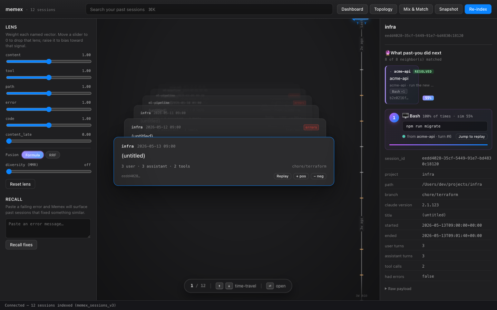
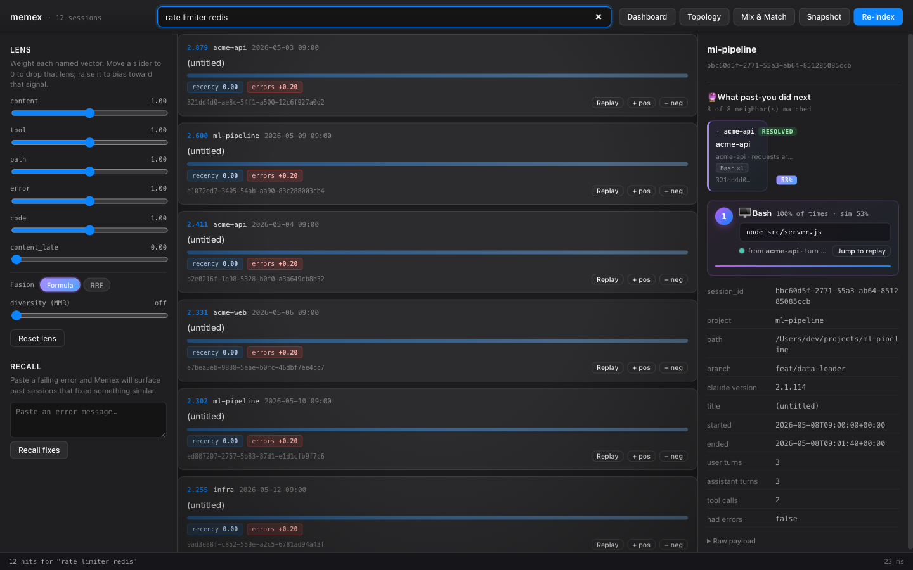
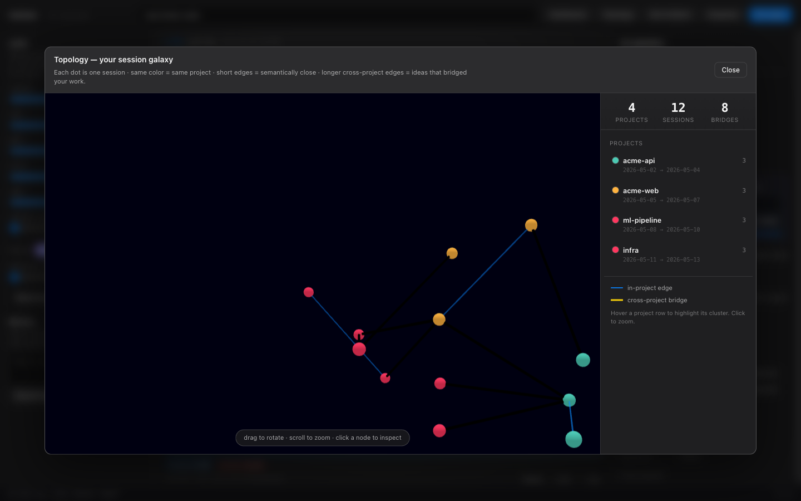
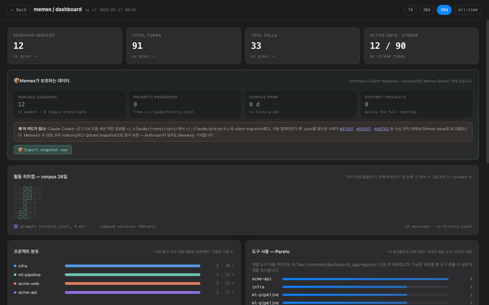

# Web/server variant vs. the macOS app — an evidence-backed comparison

> **TL;DR.** Both surfaces wrap the *same* Rust core and the *same* six
> Qdrant primitives. The **macOS app** wins native desktop UX and live
> session-watching. The **web/server variant** wins on the axes that decide a
> hackathon *proposal*: platform reach, one-command install, remote/multi-client
> access, MCP-over-HTTP for any agent, a scriptable JSON API, and a reproducible
> **offline** demo. They are complementary; this PR adds the second one without
> touching the first.
>
> Every row below is backed by a command you can re-run. Shared build/test/surface
> proof lives in [e2e-evidence.md](e2e-evidence.md); this page adds the
> web-specific evidence and is **honest about where the app is better**.

- **Verified:** 2026-05-26 · macOS (Darwin **arm64**) · docker 29.3.1 · image `memex-allinone:latest`
- **What could *not* be verified here** (stated up front, not hidden):
  - Real **Windows / Intel-macOS** hardware — single arm64 host. The web variant's
    "runs anywhere" claim is proven on **Linux (container)**; the app's macOS-only
    limit is stated honestly.
  - macOS app **notarization** — no Apple Developer cert here; the bundle is
    **adhoc-signed** (`codesign … flags=adhoc`, see e2e-evidence §6). This counts
    *against* the app in the matrix.
  - A **native amd64** image — host is arm64; an amd64 image would run under QEMU
    emulation, so no native-amd64 performance claim is made. The arm64 image is
    built and run natively here; multi-arch (`docker buildx`) is documented but
    not benchmarked.

---

## Head-to-head

| # | Axis (what a judge/operator cares about) | macOS app | Web/server variant | Evidence |
|---|---|---|---|---|
| 1 | **Platform reach** | macOS 11+ only; Tauri/WebKit; arm64 binary (`Mach-O 64-bit arm64`) | Any Docker host (Linux container); UI is any modern browser on any OS | App: `file …/release/memex → Mach-O arm64`. Web: same source builds `--no-default-features --features web` → Linux ELF in image (§A) |
| 2 | **Install friction** | `git clone` → `npm install` → `cargo build` → `npm run tauri build` → Gatekeeper bypass (adhoc-signed, **not notarized**) | **one command**: `docker run -p 8765:8765 memex-allinone`; embedding model **pre-baked**, corpus auto-indexed on boot | Web: `auto-indexed 12/12 session(s)` in logs; health OK ~4 s after run (§B). App: INSTALL.md Gatekeeper steps |
| 3 | **Remote / multi-client** | Single local user, one machine, in-process IPC only | HTTP JSON API + MCP-over-HTTP → many clients/agents, remotable over a network | Web: `curl http://host:8765/api/*` from any client; HTTP `/mcp` JSON-RPC (§C). App: Tauri IPC is in-window only |
| 4 | **MCP transports** | **stdio only** (`memex mcp`) | **stdio *and* HTTP** (`POST /mcp` JSON-RPC) — same 11 tools, same `dispatch()` | Web: HTTP `tools/list`=11 + `tools/call`; stdio (`docker exec -i … memex mcp`) `tools/list`=11 + `tools/call` (§C). Both transports proven |
| 5 | **JSON API / automation** | None (no HTTP surface) | `/api/health,search,lens,mix,topology,recall,index` + generic `/api/invoke/{cmd}` | Web: every surface returns real JSON (§D / e2e-evidence). App: none |
| 6 | **Offline / self-containment** | Needs a separately-installed local Qdrant + first-run ~130 MB model download | Qdrant **inside** the image; model pre-baked; runs with **zero network** | Web: `docker run --network none` → all surfaces answer; external DNS blocked (§B). App: model downloads on first scan |
| 7 | **Deployment / shareability** | Per-machine manual build; no artifact to hand off | Build once → push to any registry → `docker run` anywhere; CI-buildable | Web: single 556 MB image; multi-stage Dockerfile. App: no shippable artifact |
| 8 | **Hardening** | Runs as the logged-in user (full `~` access) | Non-root (`uid 10001`), `tini` PID 1, ports > 1024, storage in `$HOME` | Web: `whoami=memex`, `/proc/1/comm=tini` (§B) |

---

## Where the **app** is genuinely better (no spin)

These are real reasons the desktop app exists and is *not* replaced by the server:

1. **Native desktop UX.** A real window, OS menu bar, no browser chrome, no
   `localhost:` URL to type. For a single macOS user the app simply *feels* like a
   product; the web UI feels like a tool you started.
2. **Live proactive recall.** The app watches your **live** `~/.claude/projects`
   as you work and slides in a banner the moment a fresh tool-error matches a past
   fix. The server indexes a **corpus snapshot**, so `tail_recent_errors` correctly
   returns `[]` — there are no live sessions changing under a static server
   (documented, not a stub: `web.rs` returns an explicit empty list).
3. **Native OS integration.** Deep links (`memex://…`) and native notifications
   are delivered by the Tauri runtime; the web shim resolves those `plugin:*`
   IPC calls to `null` because a browser has no equivalent.
4. **Zero prerequisites for non-technical macOS users.** Double-click an `.app`
   vs. "install Docker first." For the app's target user that matters.
5. **Direct filesystem trust.** The app runs as you and reads `~/.claude`
   directly; the server needs the corpus mounted under a trusted sandbox root.

## Verdict

For **this hackathon submission**, the deciding question is *"can a judge run it,
can an agent consume it, and does it prove the Qdrant primitives without my
laptop?"* On those axes the **web/server variant is the stronger vehicle**:
one `docker run`, a browser UI that drives all six surfaces, a curl-able API, and
**MCP over HTTP** that any Claude/Codex/Cursor agent can call remotely — all proven
**offline**. The **app remains the better day-to-day desktop experience** for a
single macOS user and the only surface with *live* proactive recall. The honest
framing is **not** "web beats app at everything" — it's "the web variant is the
better way to *propose, demo, and integrate* Memex, and the app is the better way
to *live in* it."

---

## What it looks like in a browser (every surface, served over HTTP)

All four were captured with Playwright (real Chromium) against the all-in-one
container — **0 console errors** on load and after interaction:

| | |
|---|---|
|  |  |
| **Time Machine + Lens + Predict** — the full deck, 6 named-vector sliders, and "what past-you did next", all live | **Search** — type a query, sessions re-rank in place |
|  |  |
| **Topology galaxy** — Distance-Matrix→MST scene over WebGL | **Dashboard** — session analytics; prompt-history cells empty by design (a server has no `history.jsonl`) |

Replay (turn-by-turn) and Mix & Match (Discovery hyperplane) were also driven
interactively in the browser. The web dispatcher handles **100 % of the 16
commands** the frontend (`main.js` + `dashboard.js`) invokes.

---

## Reproduce the web-specific evidence

The exact commands and raw outputs are captured in the PR discussion; the
condensed, re-runnable forms:

```bash
# §A  same source, two targets
cargo build --release --manifest-path src-tauri/Cargo.toml                       # app: Mach-O arm64
cargo build --release --no-default-features --features web --manifest-path src-tauri/Cargo.toml   # web: native binary
docker run -d --name elf memex-allinone; docker exec elf head -c4 /opt/memex/memex | od -An -c; docker rm -f elf  # magic: 177 E L F (Linux)

# §B  one-command, offline, hardened
docker run -d --name m --network none memex-allinone
docker exec m whoami                  # memex            (non-root)
docker exec m cat /proc/1/comm        # tini             (proper init)
docker exec m curl -fsS localhost:8765/api/health    # {"qdrant":true,"status":"ok"}
docker exec m curl -fsS --max-time 4 https://huggingface.co   # fails: no network → self-contained

# §C  MCP, both transports, 11 tools
docker exec m curl -fsS -X POST localhost:8765/mcp -d '{"jsonrpc":"2.0","id":1,"method":"tools/list"}'   # HTTP
docker exec -i m memex mcp <<<'{"jsonrpc":"2.0","id":1,"method":"tools/list"}'                            # stdio

# §D  scriptable JSON API (no app equivalent)
curl -fsS 'http://localhost:8765/api/search?q=rate%20limiter%20redis&limit=3'
curl -fsS -X POST http://localhost:8765/api/lens -d '{"query":"build error","weights":{"error":2.0}}'
```
